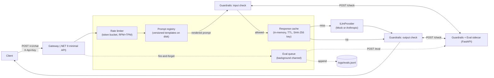

# LLM Orchestration Gateway

A minimal gateway that sits in front of an LLM API and does the things a
production caller shouldn't have to: prompt versioning, input/output
guardrails, response caching, per-client rate limiting, evaluation hooks, and
structured logging. It's a small, honest rebuild of the shape of gateway most
teams end up needing the moment more than one internal app calls an LLM
provider not a framework, not a product, a design doc with working code
attached.

## Problem

The first internal LLM integration is always a direct API call from inside
an application. The second one is a copy-paste of the first. By the third,
someone is asking questions nobody wants to answer client-by-client: which
prompt version is production actually running, did we already pay for this
exact completion once today, is one chatty client about to burn the whole
team's rate limit, did anything PII-shaped just get sent to a third party,
and how do we know a "small" prompt tweak didn't quietly make outputs worse?

A gateway is the answer, but only if it's a *thin* one. This repo draws the
line deliberately narrow: it does not do agent orchestration, it does not
manage conversation state, it does not pick between providers dynamically.
It does the boring, load-bearing stuff — the same boring stuff Azure's own
GenAI gateway guidance (API Management in front of Azure OpenAI, doing
routing / aggregation / offloading) is built around in about 500 lines
split across a .NET service and a Python sidecar.

## Architecture



One request's path: rate limit → resolve + render the versioned prompt →
guardrail the input → check cache → call the provider (or skip it on a hit)
→ guardrail + redact the output → respond → log the transcript for eval,
off the hot path.

### Why two services instead of one

The gateway itself is .NET 9 (a minimal API) the actual day-job stack this
repo is meant to demonstrate. But nearly every real guardrail and eval tool
worth using (Presidio for PII, NeMo Guardrails, RAGAS, promptfoo) is
Python-first. Rather than reimplement that ecosystem's ideas from scratch in
C#, or pull the whole gateway into Python and lose the "this is what I
actually run in prod" framing, the regex-based input/output checks and the
heuristic evaluator live in a small FastAPI sidecar the gateway calls over
HTTP. `GuardrailsClient` and `EvalQueue` are the only two classes that know
the sidecar exists swapping the sidecar's internals for a real PII
detector or an LLM-as-judge touches zero lines in the gateway.

The cost of that split is a network hop per guardrail check and a second
service to deploy worth naming, not free.

## Decisions and trade-offs

**Guardrails fail open, not closed.** If the sidecar is slow, down, or its
circuit breaker has tripped, `GuardrailsClient` lets the request through and
tags it with a `guardrails-sidecar-unavailable` violation rather than
rejecting it. That's an availability-over-strictness call appropriate for an
internal support-chat demo; a deployment handling regulated data should flip
this default to fail closed and treat a dead guardrails sidecar as a hard
outage of the whole gateway.

**Guardrails redact on output, block on input.** Blocking an input is free
nothing was generated yet. Blocking an output throws away a completion the
provider already charged for. So PII detected in a completion gets redacted
and passed through with a violation flag; only the explicit banned-content
list hard-blocks an output. Two different guardrail policies for two
different guardrail directions, made explicit rather than left as an
accident of a shared code path.

**Prompts are versioned files, not a database.** Each prompt name+version is
a small JSON file under `gateway/Prompts/`. A request can pin a version or
omit it to get the newest. This makes every prompt change a normal, git-
blamed diff and a normal redeploy no admin UI, no hot reload, no runtime
prompt-injection-via-config-API surface to secure. The trade-off is real:
there's no way to A/B two prompt versions live without a redeploy, and
version comparison (`"v1"` vs `"v2"` vs `"v10"`) is a plain string sort,
which breaks past nine versions of the same prompt. Fine at this scale;
the first thing to fix if this ever needed a real prompt-ops workflow.

**The cache key is the rendered prompt, not the request body.** Two
requests with different `variables` dictionaries that render to the same
final prompt text hit the same cache entry — the cache is keyed on
SHA-256(`name|version|maxTokens|renderedPrompt`). `ICacheStore` is an
interface with exactly one implementation (`InMemoryCacheStore`) a Redis-
backed store is a one-class addition whenever this needs to survive a
restart or be shared across gateway replicas, which it doesn't yet, so it
isn't built.

**Rate limiting is a hand-rolled token bucket, per API key, checking RPM and
TPM together.** This mirrors the split Azure's `llm-token-limit-policy`
enforces centrally at the API Management layer (Tier 2 reference material)
requests and tokens are genuinely different budgets, and a client can exhaust
either one first. Buckets refill continuously off elapsed wall-clock time
rather than resetting on a fixed tick, so there's no thundering herd at
`:00`. It's in-memory and per-instance: scale the gateway horizontally and
each replica enforces its own limit, which under-throttles in aggregate.
Fine for one instance; a shared Redis counter is the fix the moment there's
a second replica.

**Resilience is a from-scratch 30-line circuit breaker, not Polly.** Polly is
the right dependency for a real deployment fronting a paid model API this
repo's own explicit goal is a small, readable amount of code, and a
hand-rolled breaker is small enough to read start-to-finish and unit-test in
three cases (opens on threshold, resets on success, half-opens after the
break window). `ResilientLlmProvider` wraps any `ILlmProvider` as a
decorator, so the timeout-and-breaker concern never leaks into
`MockLlmProvider` or `AnthropicLlmProvider`.

**Metrics are a `/metrics` JSON snapshot, not Prometheus.** Counters and a
bounded p50/p95 latency sample, computed on request. Wiring a real
OpenTelemetry exporter is close to doubling this repo's line count for a
demo nobody scrapes named explicitly as the first thing to swap for a real
deployment, not left as a silent gap.

**The gateway and sidecar don't share a schema package they share a wire
contract.** `gateway/Models/ChatModels.cs` and `guardrails_eval/schemas.py`
are two independent definitions of the same JSON shapes, kept in sync by
convention and caught by `tests/guardrails_eval_tests/test_wire_contract.py`
rather than by a generated client. The casing mismatch this produces is real
and easy to miss: `HttpClient.PostAsJsonAsync` defaults to PascalCase,
FastAPI/pydantic defaults to whatever the Python field names are. Every
gateway→sidecar call passes `JsonSerializerDefaults.Web` explicitly
(`gateway/Services/JsonDefaults.cs`) and every pydantic model declares a
camelCase alias (`guardrails_eval/schemas.py`) so the two sides actually
agree on the wire. Skipping either half of that fix is a silent 422, not a
compile error which is exactly why it's called out here instead of left
for someone to rediscover.

## Failure modes

| Dependency down | What happens |
|---|---|
| LLM provider (Anthropic API) times out or errors | `ResilientLlmProvider`'s circuit breaker records the failure; after 5 consecutive failures (`CIRCUIT_BREAKER_FAILURE_THRESHOLD`) it opens for 30s (`CIRCUIT_BREAKER_BREAK_SECONDS`) and every request fails fast with `502 provider_unavailable` instead of queueing behind a 15s timeout each |
| Guardrails/eval sidecar down | `GuardrailsClient` fails open after its own breaker trips requests proceed, tagged `guardrails-sidecar-unavailable`; the eval POST in `EvalQueue` is best-effort and only logged on failure, since eval is observability, not a request-path dependency |
| Cache store (in future: Redis) down | Not handled today `InMemoryCacheStore` can't go down independently of the process it lives in. The seam (`ICacheStore`) exists for exactly this reason once a real cache backend is added |
| One client exhausts its rate limit | Only that API key's bucket is affected (`ConcurrentDictionary<string, Bucket>` keyed per key) a noisy client gets `429`s with an accurate `Retry-After`, everyone else is unaffected |
| Gateway process restarts | Cache and rate-limit state are in-memory and lost; prompts reload from disk; nothing crashes, everything just goes briefly cold |

## What I'd do differently

Given more time, in roughly the order I'd tackle them: move the cache and
rate limiter to Redis so the gateway can run more than one replica without
each one having its own idea of the world; replace the version string sort
in `PromptRegistry` with real semver parsing before anyone registers a
`v10`; add a real PII detector (Presidio) behind the same `check_input` /
`check_output` functions instead of hand-rolled regex, which both
under- and over-matches; make the guardrails fail-open/fail-closed behavior
a config flag instead of a hardcoded default; and add the OpenTelemetry
exporter the `/metrics` endpoint is standing in for. None of these change
the shape of the design they replace a named stand-in with the real thing
behind the same interface, which is the point of having drawn the
interfaces where I did.

## Running it

```bash
cp .env.example .env
docker compose up --build
```

- Gateway: `http://localhost:8080` try `POST /v1/chat` with
  `{"promptName": "chat-support", "variables": {"message": "Where's my order?"}}`
- Guardrails/eval sidecar: `http://localhost:8081`
- `GET /healthz` and `GET /metrics` on the gateway
- Everything runs against `LLM_PROVIDER=mock` by default — no API key
  needed. Set `LLM_PROVIDER=anthropic` and `ANTHROPIC_API_KEY` in `.env` to
  hit the real Messages API instead.

Eval transcripts land in `logs/evals.jsonl` as they're generated. Replay them
through the same heuristics offline (e.g. in CI, before a prompt-version
bump ships):

```bash
python -m guardrails_eval.evals.run_eval logs/evals.jsonl
```

## Testing

```bash
# Python: guardrail checks + the gateway<->sidecar wire contract
pip install -r guardrails_eval/requirements.txt
pytest tests/guardrails_eval_tests/ -v

# .NET: cache-key, rate-limiter, and circuit-breaker unit tests
dotnet test tests/Gateway.Tests/
```

The Python suite is verified in this repo's own dev environment (10/10
passing) along with a live `/check` and `/eval` smoke test against the
running sidecar. The .NET SDK wasn't available in the environment this repo
was written in, so `tests/Gateway.Tests` is written and reviewed carefully
but not compiler-verified here run `dotnet test` locally before trusting
it in CI.

## Layout

```
gateway/            .NET 9 minimal API the actual gateway
  Program.cs           wiring + the /v1/chat, /healthz, /metrics endpoints
  Services/            providers, cache, rate limiter, guardrails client, eval queue, circuit breaker
  Models/              request/response + wire-contract records
  Prompts/             versioned prompt templates (name-version.json)
guardrails_eval/    FastAPI sidecar input/output checks + heuristic eval
  checks/              regex-based input and output guardrails
  evals/               inline heuristics + the offline replay CLI
tests/
  Gateway.Tests/        xUnit: cache key, rate limiter, circuit breaker
  guardrails_eval_tests/ pytest: guardrail checks + wire-contract round trip
docker-compose.yml   both services, wired together, mock provider by default
```
